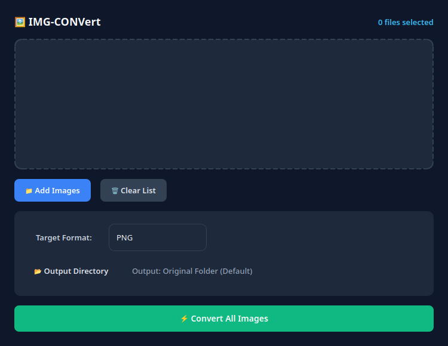
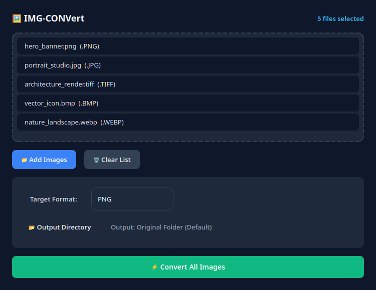
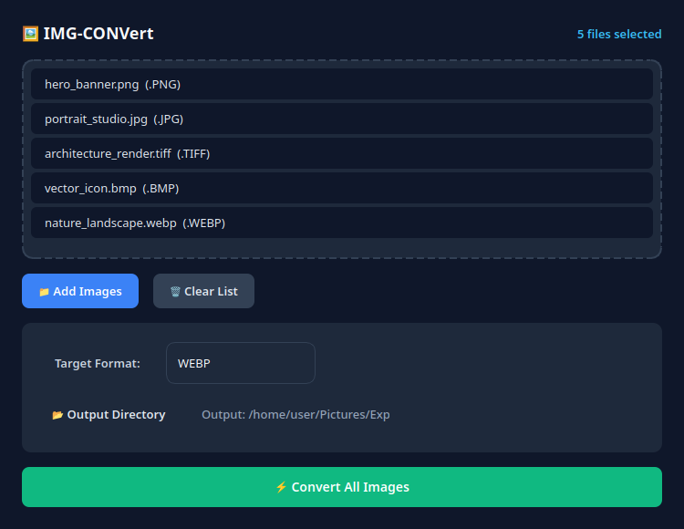
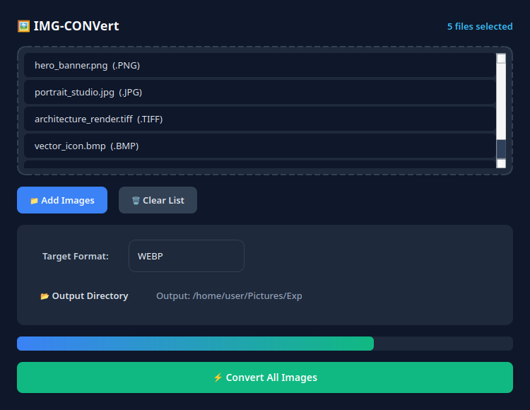
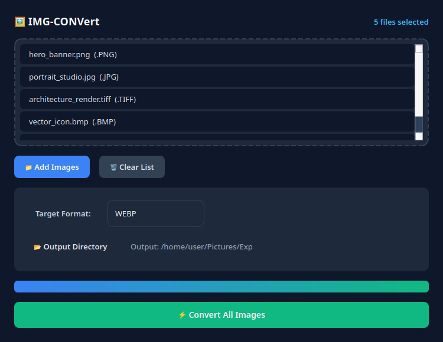
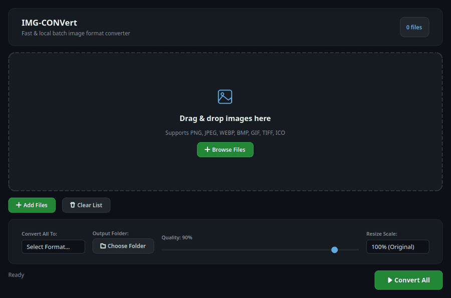

<div align="center">


# IMG-CONVert

_"Blazing-fast batch image converter — local, privacy-first, and completely open source."_

[](https://github.com/MUHAMMEDHAFEEZ/IMG-CONVert/releases)
[](LICENSE)
[](#download--install)
[](#how-it-works)
[](#download--install)

[Screenshots](#screenshots) · [Features](#features) · [Supported Formats](#supported-formats) · [Download & Install](#download--install) · [How It Works](#how-it-works) · [Development](#development)

</div>

---

**IMG-CONVert** is a powerful desktop application built with Python, PyQt6, and Pillow. It enables instant, multi-threaded batch conversion of images across all major image formats (PNG, JPEG, WEBP, BMP, GIF, TIFF, ICO). Designed with a clean, dark-mode modern UI, it processes hundreds of photos in seconds directly on your local machine with zero cloud uploads or telemetry.

---

## Screenshots

<table>
<tr>
<td width="50%">

**Clean, modern interface**


</td>
<td width="50%">

**Drag &amp; drop batch queue**


</td>
</tr>
<tr>
<td width="50%">

**Select target format &amp; output directory**


</td>
<td width="50%">

**Real-time progress tracking**


</td>
</tr>
</table>

<details>
<summary><strong>Instant completion dialog</strong></summary>
<br />

</details>

<br />



---

## Features

- ⚡ **Blazing-Fast Batch Processing** — Convert dozens or hundreds of image files simultaneously with non-blocking UI thread execution.
- 🎨 **Wide Format Support** — Full conversion support for `PNG`, `JPEG`, `JPG`, `WEBP`, `BMP`, `GIF`, `TIFF`, and `ICO`.
- 🖱️ **Drag &amp; Drop Support** — Simply drop files or folders directly into the queue to start converting instantly.
- 📂 **Flexible Output Directory** — Export converted images to their original source folders or set a custom destination path.
- 🔒 **100% Local &amp; Private** — Every operation runs locally on your CPU. Zero telemetry, no cloud API keys, and no network dependencies.
- 🧵 **Multi-Threaded Engine** — Heavy image encoding happens asynchronously on background worker threads (`QThread`), keeping the interface smooth and responsive.
- 🖥️ **Cross-Platform Ready** — Automated GitHub Actions workflows build standalone executables for **Windows (.exe)** and **macOS (.app)**.

---

## Supported Formats

| Format | Extension | Color Mode Handling | Best Used For |
| :--- | :--- | :--- | :--- |
| **PNG** | `.png` | Preserves RGBA (Alpha Transparency) | Web graphics, logos, screenshots |
| **WEBP** | `.webp` | High compression, transparency support | Next-gen web performance & fast page loads |
| **JPEG / JPG** | `.jpg`, `.jpeg` | Auto-converts RGBA/Palette to RGB | Photographs, digital prints |
| **BMP** | `.bmp` | Lossless uncompressed bitmap | Windows applications & legacy graphics |
| **GIF** | `.gif` | Palette / Frame conversion | Web animations, simple icons |
| **TIFF** | `.tiff`, `.tif` | High-fidelity raw bitmap format | Printing, publishing, scanning |
| **ICO** | `.ico` | Icon file format | App icons, web favicons |

---

## Download & Install

### Option 1: Download Standalone Binary (Pre-built)
Download the ready-to-run executables from [GitHub Releases](https://github.com/MUHAMMEDHAFEEZ/IMG-CONVert/releases) or the **Actions Artifacts**:

- 🪟 **Windows**: Download `IMG-CONVert-Windows.zip` and run `IMG-CONVert.exe`.
- 🍏 **macOS**: Download `IMG-CONVert-macOS.zip`, extract `IMG-CONVert.app`, and drag it to your `Applications` folder.

---

### Option 2: Run directly via Python

Works on **macOS**, **Linux**, and **Windows**:

```bash
# 1. Clone the repository
git clone https://github.com/MUHAMMEDHAFEEZ/IMG-CONVert.git
cd IMG-CONVert

# 2. Install dependencies
pip install -r requirements.txt

# 3. Launch the application
python image_converter.py
```

---

## Building Executables

### 🍏 Build for macOS locally
If you are on a Mac device:

```bash
# Grant execution permissions
chmod +x build_mac.sh

# Run the macOS build script
./build_mac.sh
```
The output `.app` bundle and `.zip` archive will be placed inside the `dist/` directory.

### 🪟 Build for Windows locally
On a Windows machine, run:

```cmd
build_windows.bat
```
The standalone `IMG-CONVert.exe` will be generated inside the `dist/` directory.

---

## How It Works

```
┌──────────────────────────────┐        PyQt Signals (QtThread)        ┌──────────────────────────────┐
│     PyQt6 Desktop UI         │ ────────────────────────────────────▶ │   ConversionThread (Worker)  │
│  - Drag & Drop Event Handler │                                       │  - PIL.Image Open & Convert  │
│  - Progress Bar & Format     │ ◀──────────────────────────────────── │  - High Quality Save Stream  │
└──────────────────────────────┘           Progress (0% - 100%)        └──────────────────────────────┘
```

1. **User Queue**: Selected or dropped image files are validated for supported extensions and queued in `DropListWidget`.
2. **Asynchronous Threading**: Clicking **Convert All** spawns a dedicated `ConversionThread` to handle PIL image operations off the main GUI thread.
3. **Format Normalization**: Transparency channels (RGBA / Palette mode) are safely converted to RGB when targeting JPEG formats to prevent PIL runtime crashes.
4. **Progress Broadcasting**: The background thread emits percentage updates back to the PyQt main loop via `pyqtSignal(int)`, smoothly animating the progress bar.

---

## Development

```bash
# Clone & setup virtual environment
git clone https://github.com/MUHAMMEDHAFEEZ/IMG-CONVert.git
cd IMG-CONVert
python3 -m venv venv
source venv/bin/activate  # On Windows: venv\Scripts\activate

# Install dependencies
pip install -r requirements.txt

# Run app in dev mode
python image_converter.py
```

**Stack:** Python 3.11 · PyQt6 · Pillow (PIL) · PyInstaller.

---

## License

This project is licensed under the [MIT License](LICENSE).
